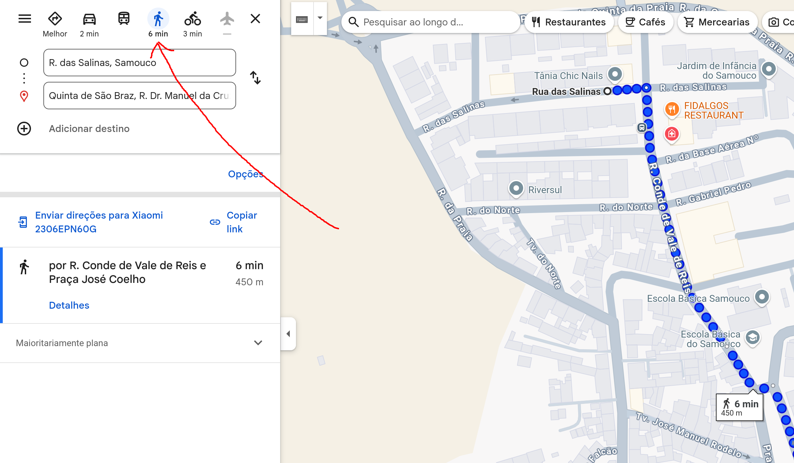
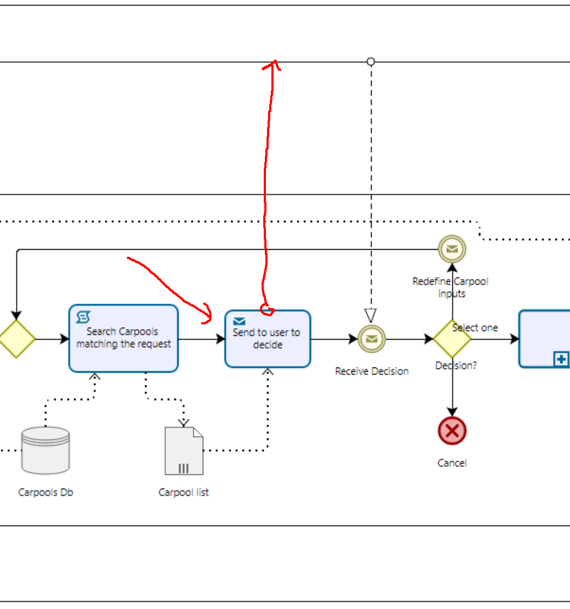
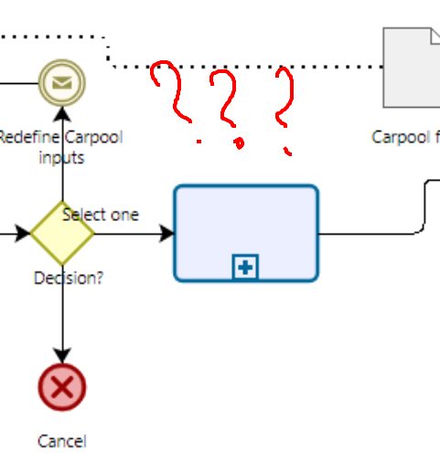
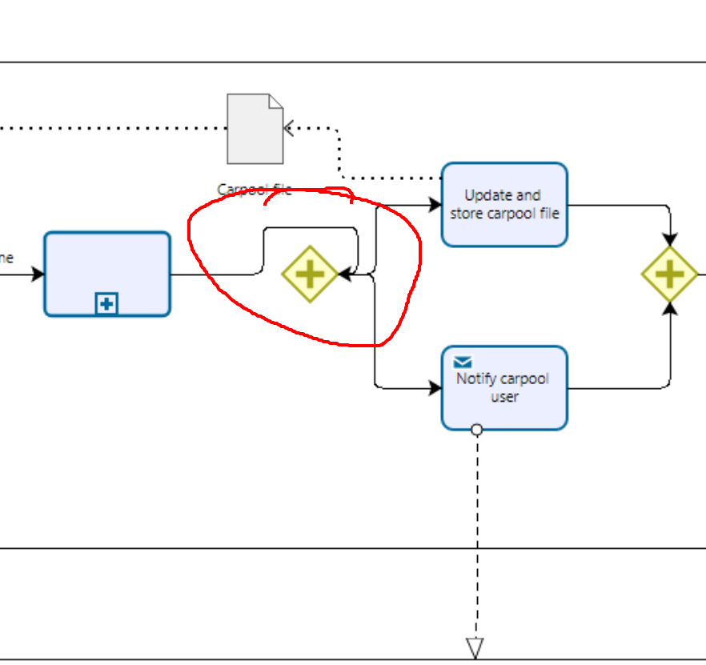
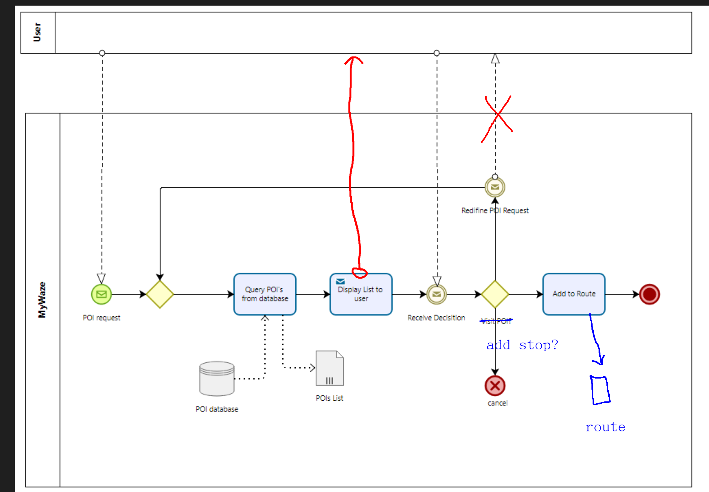
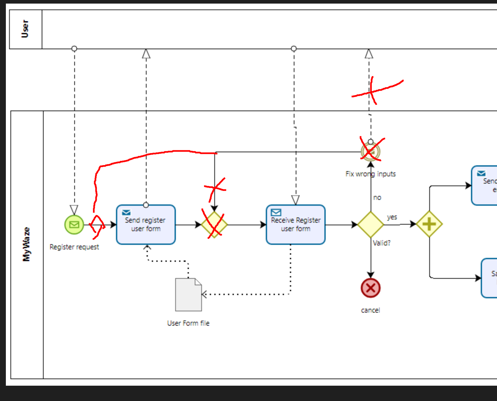
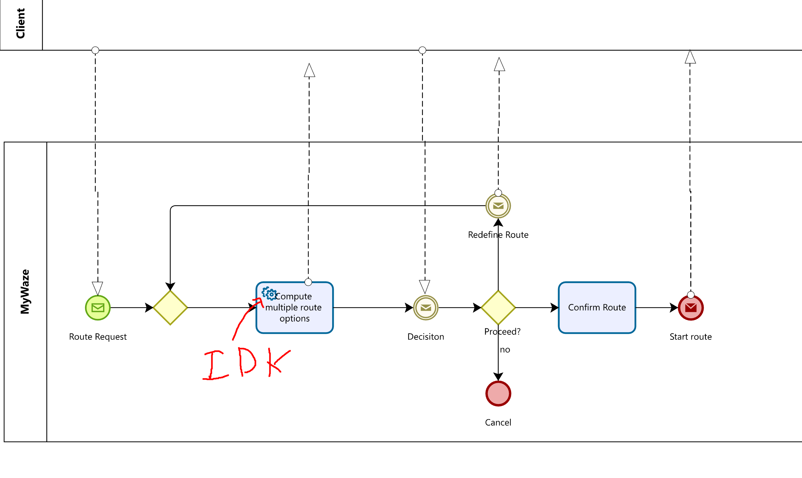
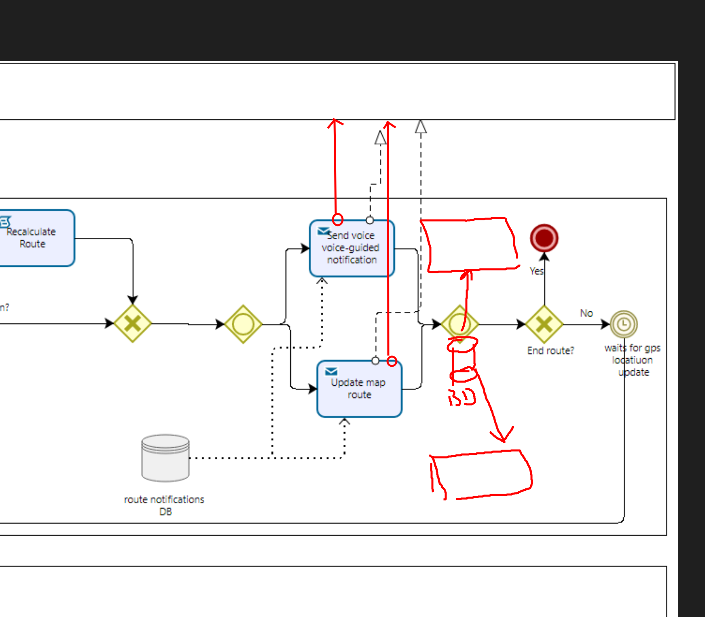
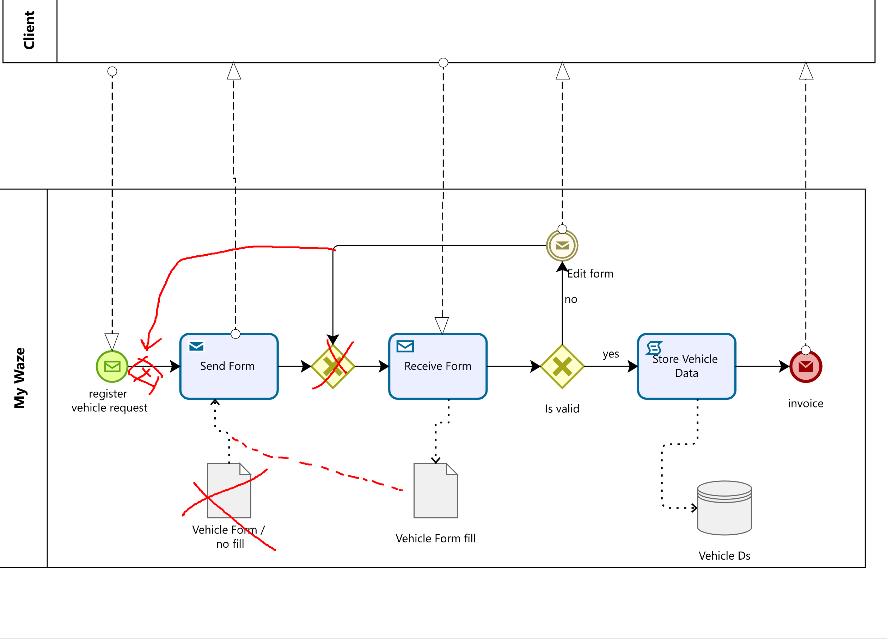

# Review of corrected BPMNs (Quality Control)

## Bernardo

### Eta By Foot

- User lane acaba antes das restantes, idk se é suposto but it does not look good 
- Not sure se o inicio do processo n devia ser um notification event vindo do user a dizer que o quer um caminho a pé (tipo carregar ai em baixo)
  
- Picuinhice mas not sure se é necessario dar "process speed of user" acho que assumindo uma average speed de caminha e distancia ao ponto should be enough (i mean tirar a task "process speed of user" e deixar subentendido que isso é feito no "calculate ETA", até pq para process speed of user era preciso comunicar com gps (notif para a lane do gps))
- de resto esta good

### Map Personalization

- Honestly acho que o bpmn desta feature devia ser muito mais simples, pq na app do waze qnd escolhes personalizar o mapa eles nem te dão a opção de reverter as escolhas (por exemplo se mudares o map de 2d para 3d ou mudar o iconzinho do veiculo aquilo muda só, n pede para confirmar)
- Isto é mudar uma vizualização do mapa, não uma resolução de um ecrã xd 😂

### Speed Alert

- All good imo

## João Felix

### Car pool

- Not sure se é assim que tem que estar, mas um notification task n devia comunicar com outra lane? (pic abaixo)

- Task com subprocesso a sem nada??

- Ligeiro problema de formatação 

### POI Finder

- Como eu faria (n quer dizer que esteja certo!!)
  

### Register user

- como eu faria novamente 
  

## Guilherme

### Define Route

- Not sure se esse tipo de task pode comunicar com outras lanes (se sim o bpmn está ok imo)

### Music App Integration

- Parece me ok

### Voice Guided Notification

- Podia estar um bit mais bonito (pic descreve isso acho eu, sou horrivel a desenhar xd - meter a db entre as tasks ficava mais clean imo)

- posso ter percebido mal a logica disso mas achio que um parallel gateway fazia mais sentido em vez de um inclusive

## Lamy 

### Multi-Stop Route
- Ya esta fixe imo

### Register vehicle / Store vehicle

- Estou dividido neste (idk tbh)
  

### Report Incidents

- also fixe imo

## Yaros 

### ALT BPMN

- O subprocesso onde o user n seguiu indicação nenhuma devia levar a um subprocesso (define route por exemplo) ou um end event, pq assim esse subprocesso n acaba.
- Same para o refocus Route

### ETA

- Ok começo a pensar que estou a complicar as cenas, mas o ETA devia ser calculado/aparecer antes de começares a viajem ou durante (neste acaso acho que esta só a ser considerado o durante)

### Notif Event

- Pessoalmente acho que isto dava para ficar mais clean (baised pq é o meu bpmn 🤣)
- Echo que esta fucked ou percebi mal, mas como é que o "no" levou a "response" e "open notification"
- Se há eventos nearby o user é notificado e o processo acaba ai?